# HBXL Job Tracker - Visual Workflow

## 📊 Database Relationships

---

## 🔄 Job Upload & Assignment Workflow

---

## 📅 Daily Work Cycle

```mermaid
flowchart TD
    Morning[8:15 AM<br/>Morning Check-in] --> SendMsg[n8n Sends Messages<br/>to All Contractors]
    SendMsg --> ContractorReply{Contractor<br/>Reply}
    
    ContractorReply -->|Yes/Working| RecordPresent[Record Check-in<br/>Status: Present]
    ContractorReply -->|Reason| RecordAbsent[Record Check-in<br/>Status: Absent + Reason]
    
    RecordPresent --> WorkDay[During Work Day]
    RecordAbsent --> WorkDay
    
    WorkDay --> VoiceMsg[Contractor Sends<br/>Voice Message]
    VoiceMsg --> Transcribe[Transcribe with Whisper API]
    Transcribe --> AnalyzeAI[AI Analyzes Content]
    
    AnalyzeAI --> IsProgress{Is Progress<br/>Update?}
    IsProgress -->|Yes| ExtractInfo[Extract:<br/>- Which room?<br/>- Which phase?<br/>- Completion %]
    IsProgress -->|No| ChatbotReply[AI Chatbot Reply]
    
    ExtractInfo --> UpdateDB[Update Database:<br/>- Phase Progress<br/>- Room Status<br/>- Completion %]
    UpdateDB --> CalcPayment[Calculate Payment]
    
    CalcPayment --> CheckModel{Pricing<br/>Model}
    CheckModel -->|Hourly| CalcHours[Hours × Rate]
    CheckModel -->|Per Room| CalcRooms[Completed Rooms × Rate]
    
    CalcHours --> SendConfirm[Send Confirmation<br/>to Contractor]
    CalcRooms --> SendConfirm
    ChatbotReply --> SendConfirm
    
    SendConfirm --> EndDay[End of Day<br/>Generate Reports]
```

---

## 💰 Payment Calculation Logic

```mermaid
flowchart TD
    Start([Calculate Payment]) --> GetAssignment[Get Contractor Assignment]
    GetAssignment --> CheckModel{Pricing Model}
    
    CheckModel -->|Hourly| GetHours[Get Work Sessions<br/>for Today]
    CheckModel -->|Per Room| GetRooms[Get Completed Rooms<br/>for Today]
    CheckModel -->|Per Phase| GetPhases[Get Completed Phases<br/>for Today]
    CheckModel -->|Fixed Price| GetMilestones[Get Completed Milestones]
    
    GetHours --> CalcHourly[Total Hours × Hourly Rate]
    GetRooms --> CalcRoom[Rooms Completed × Price Per Room]
    GetPhases --> CalcPhase[Phases Completed × Phase Price]
    GetMilestones --> CalcFixed[Milestone % × Fixed Price]
    
    CalcHourly --> UpdateOwed[Update Amount Owed]
    CalcRoom --> UpdateOwed
    CalcPhase --> UpdateOwed
    CalcFixed --> UpdateOwed
    
    UpdateOwed --> CheckBudget{Within<br/>Budget?}
    CheckBudget -->|Yes| SavePayment[Save Payment Record]
    CheckBudget -->|No| AlertAdmin[Alert Admin<br/>Budget Exceeded]
    
    SavePayment --> NotifyContractor[Notify Contractor<br/>Payment Calculated]
    AlertAdmin --> NotifyContractor
```

---

## 🏠 Room Completion Tracking

---

## 📊 Example: 4-Bedroom Job Flow

**Payment Breakdown:**
- Main Contractor: £25/hour × 96 hours = £2400
- Subcontractor: £1000/room × 4 rooms = £4000
- **Total Labour**: £6400
- **Material Cost**: £13725.23 (from HBXL)
- **Total Job Cost**: £20125.23

---

## 🎯 Key Features Summary

### 1. **Flexible Contractor Pricing**
- Hourly rates for main contractors
- Per-room pricing for subcontractors
- Per-phase pricing option
- Fixed-price option

### 2. **Accurate Progress Tracking**
- Link voice updates to specific rooms
- Track phase completion percentages
- Before/after photos required
- Admin approval workflow

### 3. **Automated Payment Calculation**
- Real-time payment tracking
- Budget vs. spent monitoring
- Payment approval workflow
- Contractor payment history

### 4. **HBXL Integration**
- Import phases from HBXL
- Track material costs separately
- Match labour to phases
- Budget compliance alerts

### 5. **Telegram Bot Intelligence**
- Understands room names in voice messages
- Automatically updates progress
- Calculates payments on completion
- Sends notifications to admin
